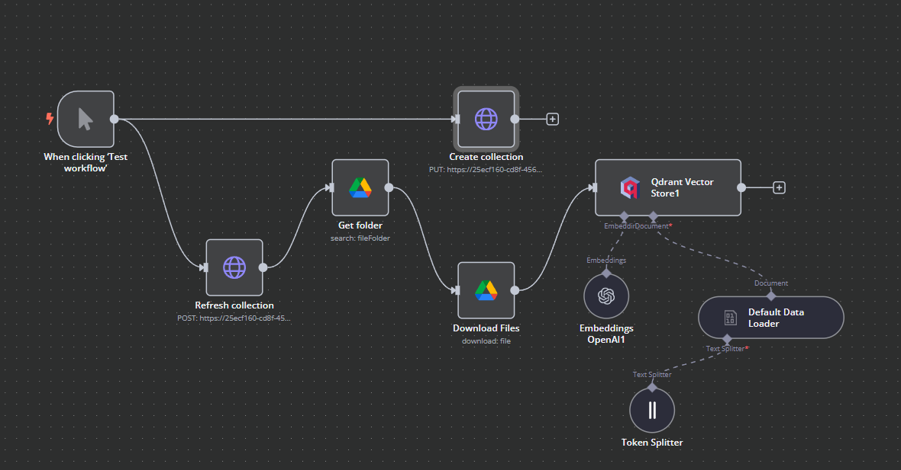
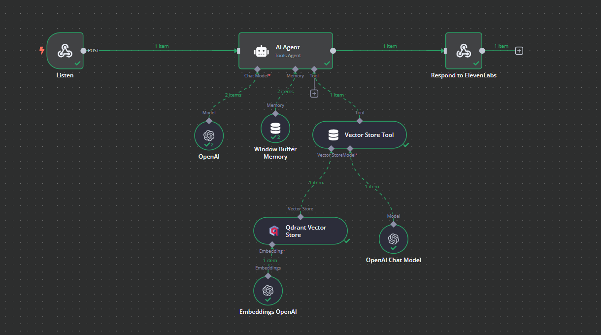

# WF-18: Restaurant Info Agent – n8n Workflow

## 📌 Overview
This **n8n workflow**, `WF-18: Restaurant Info Agent`, is an AI-powered **knowledge retrieval system** for restaurant-related queries. It leverages a vector database to store and retrieve relevant restaurant details and responds to user questions dynamically.

## 🔧 Workflow Components
### 🏗️ Core Modules
1. **🌐 Webhook Listener** – Captures incoming user queries.
2. **🤖 AI Agent** – Processes queries and determines the best response.
3. **📚 Qdrant Vector Store** – Stores and retrieves restaurant information using embeddings.
4. **📝 Vector Store Tool** – Queries relevant restaurant data based on user input.
5. **🧠 Window Buffer Memory** – Maintains session history for improved contextual responses.
6. **🔄 Refresh Collection** – Ensures up-to-date information by refreshing the vector store.
7. **📂 Google Drive Integration** – Retrieves restaurant documents for vector embedding.
8. **📊 Token Splitter & Embeddings Generator** – Converts text data into structured embeddings.
9. **✍️ OpenAI Chat Model** – Generates AI-driven responses based on retrieved data.
10. **✅ Respond to Webhook** – Sends the AI-generated response back to the user.

## ⚙️ How It Works
1. 🌐 A **user submits a restaurant-related question** via the webhook.
2. 🤖 The **AI Agent** processes the query and searches for relevant restaurant details.
3. 📚 The **Qdrant Vector Store** retrieves the most relevant information.
4. 📝 The **Vector Store Tool** refines the response using stored knowledge.
5. 🧠 The **Window Buffer Memory** maintains conversation history for continuity.
6. ✍️ The **OpenAI Chat Model** generates a well-structured, conversational response.
7. ✅ The **Respond to Webhook** node returns the AI-generated response to the user.

## 📷 Workflow Screenshot

## 🚀 Setup Instructions
- 📥 **Import the workflow** into `n8n`.
- 🔑 **Ensure API credentials** for OpenAI, Qdrant, and Google Drive are configured.
- ✅ **Activate the workflow** to start responding to restaurant queries.

## 📝 Notes
- ⚠️ The workflow is **inactive by default**.
- 🛠️ Modify data sources to include **custom restaurant databases or APIs**.
- 💡 Can be enhanced with **real-time reservation and menu fetching**.
